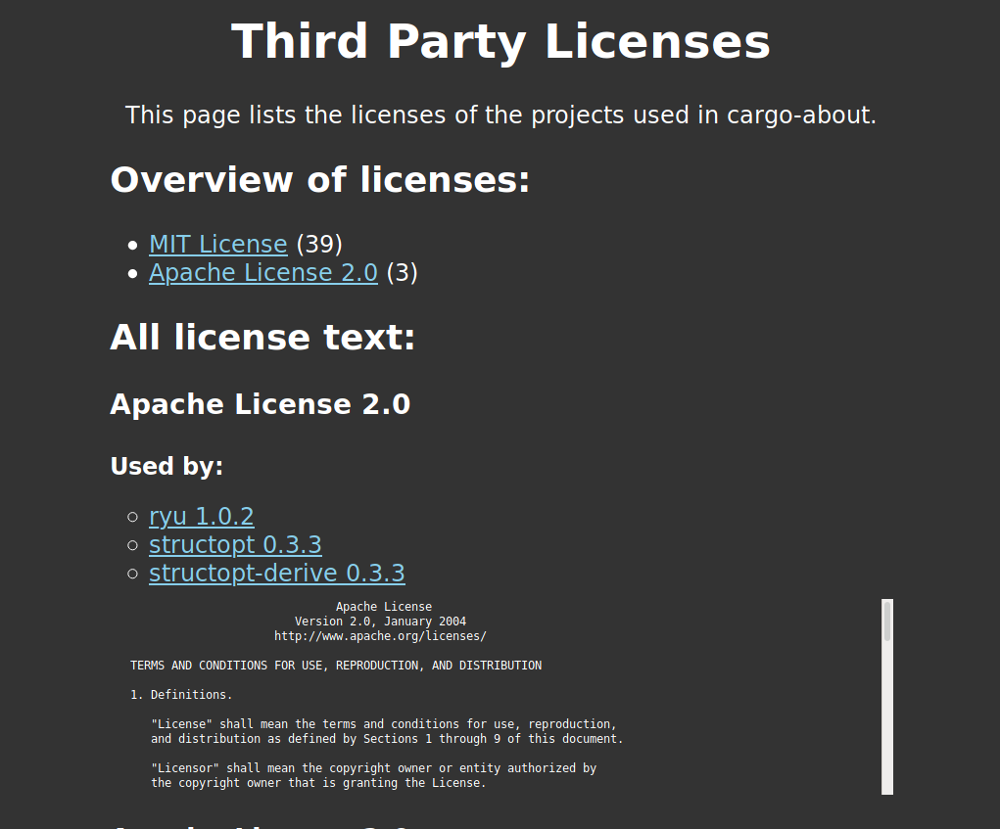

# 📋 cargo-about

[](https://github.com/EmbarkStudios/cargo-about/actions?workflow=CI)
[](https://crates.io/crates/cargo-about)
[](https://docs.rs/cargo-about)
[](CODE_OF_CONDUCT.md)
[](https://embark.dev)

Cargo plugin for generating a listing of all of the crates used by a root crate, and the the terms under which they are licensed.



You can view the full license [here](media/license.html)

## Getting started:

### Installing

```
cargo install cargo-about
```

### Generating `license.html` for `cargo-about`

```bash
cd cargo-about
cargo about generate about.hbs > license.html
```

### Generating license information for your own project

Create an `about.toml` file in the root of your project

```toml
# Add licenses that you accept for your project
accepted = [
    "Apache-2.0",
    "MIT",
]
```

`cargo-about` uses [handlebars](https://handlebarsjs.com/) to generate license information. An easy way to get started is to use the [about.hbs](about.hbs) from `cargo-about`


Generate the license information with `cargo about generate about.hbs > license.html`

### Adding additional licenses to `about.toml`

Not all licenses are placed in seperate licnese files. Those files can be explicity added like this:

```toml
[[physx-sys.additional]]
root = "PhysX"
license = "BSD-3-Clause"
license-file = "PhysX/README.md"
license-start = 3
license-end = 28
```

### Ignoring specific licenses in `about.toml`

Sometimes libraries include licenses for example code that you don't want to use. You can ignore those licenses with:
```toml
[[imgui-sys.ignore]]
license = "Zlib"
license-file = "third-party/cimgui/imgui/examples/libs/glfw/COPYING.txt"
```

## FAQ

### Unable to satisfy the following licenses

```bash
[ERROR] Crate 'aho-corasick': Unable to satisfy [Unlicense OR MIT], with the following accepted licenses [Apache-2.0]
```

In this case you are missing either `MIT` or `Unlicense` as an `accepted` license in your `about.toml`

## Contributing

We welcome community contributions to this project.

Please read our [Contributor Guide](CONTRIBUTING.md) for more information on how to get started.

## License

Licensed under either of

* Apache License, Version 2.0, ([LICENSE-APACHE](LICENSE-APACHE) or http://www.apache.org/licenses/LICENSE-2.0)
* MIT license ([LICENSE-MIT](LICENSE-MIT) or http://opensource.org/licenses/MIT)

at your option.

### Contribution

Unless you explicitly state otherwise, any contribution intentionally submitted for inclusion in the work by you, as defined in the Apache-2.0 license, shall be dual licensed as above, without any additional terms or conditions.
